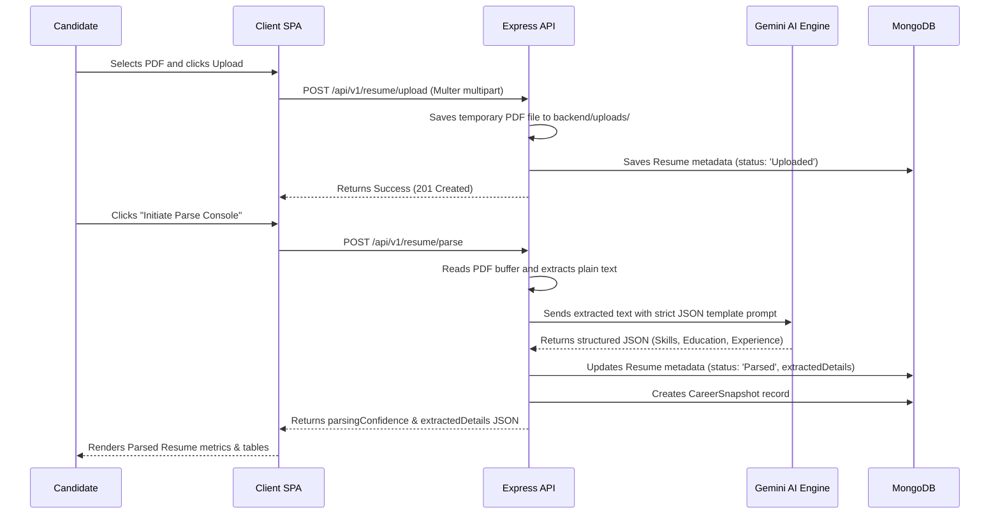
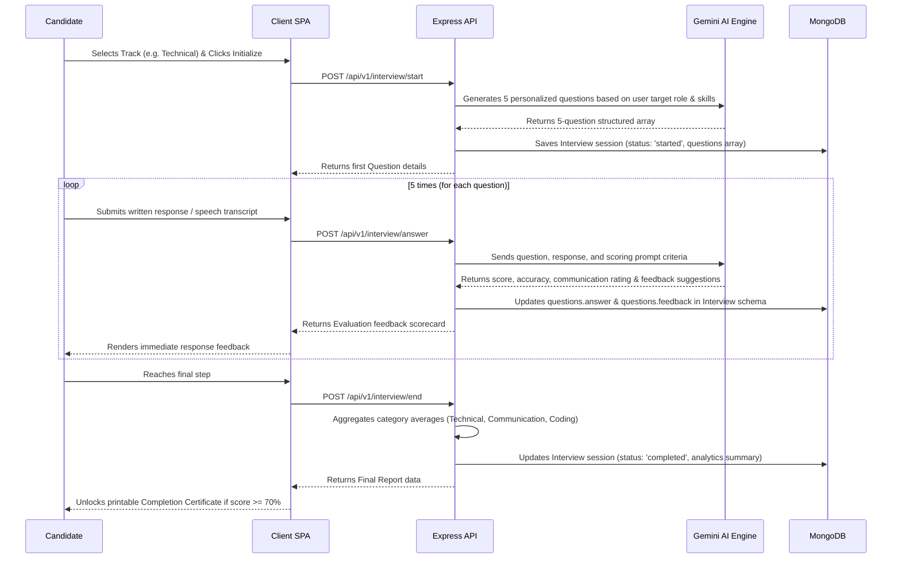

# PrepAI – System Architecture & Data Flow

PrepAI is designed as a decoupled, standard MERN (MongoDB, Express, React, Node.js) system with pure JavaScript (ES6+). This architecture provides a clear separation of concerns, high modularity, and reliable scaling.

---

## 1. Component Architecture Topology

```mermaid
graph TB
    subgraph Client View Layer (React 19)
        A[Vite React SPA] --> B[Auth Pages / Guards]
        A --> C[Dashboard / Console]
        A --> D[Resume / ATS Parser]
        A --> E[Mock Placement Simulator]
        A --> F[Analytics & Certificates]
    end

    subgraph API Controller Layer (Express.js)
        B -->|JWT Token / Credentials| G[Auth Router]
        C -->|Secure Request| H[Dashboard Router]
        D -->|PDF Upload / Parse request| I[Resume Router]
        E -->|Initialize / Answer / End| J[Interview Router]
        F -->|Fetch stats / Print cert| K[Analytics Router]
    end

    subgraph Business Service Layer (Node.js)
        I -->|Parse Document File| L[Resume Parser Service]
        J -->|Construct Prompts| M[Gemini AI prompt builder]
        J -->|Evaluate Answers| N[AI Evaluation Engine]
        L -->|Analyze Skills| O[Gemini API Client]
        M -->|Send Context| O
        N -->|Verify Concepts| O
    end

    subgraph Persistent Storage Layer
        G -->|Save Credentials| P[(MongoDB Atlas)]
        H -->|Query Stats| P
        I -->|Save Extracted Details| P
        J -->|Save Sessions & Scores| P
        K -->|Query Charts & Certificates| P
    end
```

---

## 2. Dynamic Ingestion Pipelines

### A. Resume Upload & ATS Parsing Flow


### B. Mock Interview Lifecycle & Evaluation


---

## 3. Decoupled Workspace Scalability Strategy

PrepAI ensures that high-load operations (such as dynamic AI processing) do not block main application components:

*   **Static Asset Delivery:** The React 19 frontend is bundled via Vite and is optimized for zero-overhead static hosting on Content Delivery Networks (CDNs) like Vercel or Netlify.
*   **Encapsulated Integration APIs (`backend/lib/`):** Third-party API clients, including the Google Gemini AI SDK, email SMTP relays, and file upload systems, are quarantined inside dedicated library scripts. Swapping AI versions (e.g. upgrading to a newer Gemini flash/pro model) requires no changes to Express routers or controller bodies.
*   **Centralized Exception Middleware (`backend/errors/`):** App exceptions are managed via custom error subclasses (such as `UnauthorizedError`, `BadRequestError`, and `NotFoundError`) extending a base `AppError` class. A global Express error interceptor maps these to standardized JSON payloads, preventing application crashes.
